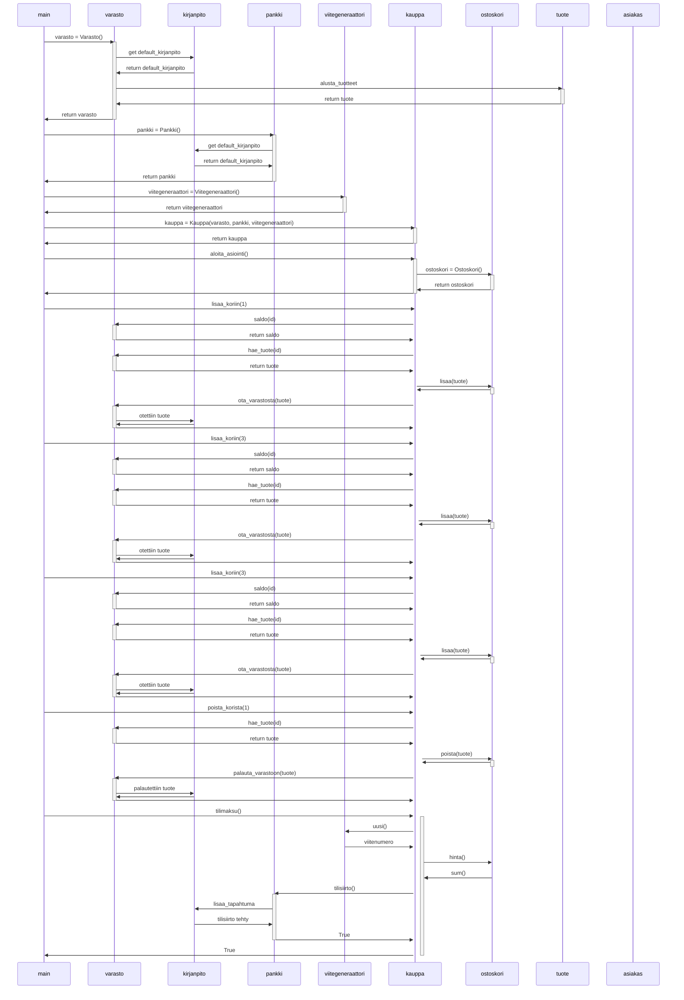

```mermaid
sequenceDiagram
    participant main
    participant varasto
    participant kirjanpito
    participant pankki
    participant viitegeneraattori
    participant kauppa
    participant ostoskori
    participant tuote
    participant asiakas
    main->>varasto: varasto = Varasto()
    activate varasto
    varasto->>kirjanpito: get default_kirjanpito
    kirjanpito->>varasto: return default_kirjanpito
    varasto->>tuote: alusta_tuotteet
    activate tuote
    tuote->>varasto: return tuote
    deactivate tuote
    varasto->>main: return varasto
    deactivate varasto
    main->>pankki: pankki = Pankki()
    activate pankki
    pankki->>kirjanpito: get default_kirjanpito
    kirjanpito->>pankki: return default_kirjanpito
    pankki->>main: return pankki
    deactivate pankki
    main->>viitegeneraattori: viitegeneraattori = Viitegeneraattori()
    activate viitegeneraattori
    viitegeneraattori->>main: return viitegeneraattori
    deactivate viitegeneraattori
    main->>kauppa: kauppa = Kauppa(varasto, pankki, viitegeneraattori)
    activate kauppa
    kauppa->>main: return kauppa
    deactivate kauppa
    main->>kauppa: aloita_asiointi()
    activate kauppa
    kauppa->>ostoskori: ostoskori = Ostoskori()
    activate ostoskori
    ostoskori->>kauppa: return ostoskori
    deactivate ostoskori
    kauppa->>main: 
    deactivate kauppa
    main->>kauppa: lisaa_koriin(1)
    activate kauppa
    kauppa->>varasto: saldo(id)
    activate varasto
    varasto->>kauppa: return saldo
    deactivate varasto
    kauppa->>varasto: hae_tuote(id)
    activate varasto
    varasto->>kauppa: return tuote
    deactivate varasto
    kauppa->>ostoskori: lisaa(tuote)
    activate ostoskori
    ostoskori->>kauppa: 
    deactivate ostoskori
    kauppa->>varasto: ota_varastosta(tuote)
    activate varasto
    varasto->>kirjanpito: otettiin tuote
    kirjanpito->>varasto: 
    varasto->>kauppa: 
    deactivate varasto
    main->>kauppa: lisaa_koriin(3)
    activate kauppa
    kauppa->>varasto: saldo(id)
    activate varasto
    varasto->>kauppa: return saldo
    deactivate varasto
    kauppa->>varasto: hae_tuote(id)
    activate varasto
    varasto->>kauppa: return tuote
    deactivate varasto
    kauppa->>ostoskori: lisaa(tuote)
    activate ostoskori
    ostoskori->>kauppa: 
    deactivate ostoskori
    kauppa->>varasto: ota_varastosta(tuote)
    activate varasto
    varasto->>kirjanpito: otettiin tuote
    kirjanpito->>varasto: 
    varasto->>kauppa: 
    deactivate varasto
    main->>kauppa: lisaa_koriin(3)
    activate kauppa
    kauppa->>varasto: saldo(id)
    activate varasto
    varasto->>kauppa: return saldo
    deactivate varasto
    kauppa->>varasto: hae_tuote(id)
    activate varasto
    varasto->>kauppa: return tuote
    deactivate varasto
    kauppa->>ostoskori: lisaa(tuote)
    activate ostoskori
    ostoskori->>kauppa: 
    deactivate ostoskori
    kauppa->>varasto: ota_varastosta(tuote)
    activate varasto
    varasto->>kirjanpito: otettiin tuote
    kirjanpito->>varasto: 
    varasto->>kauppa: 
    deactivate varasto
    main->>kauppa: poista_korista(1)
    activate kauppa
    kauppa->>varasto: hae_tuote(id)
    activate varasto
    varasto->>kauppa: return tuote
    deactivate varasto
    kauppa->>ostoskori: poista(tuote)
    activate ostoskori
    ostoskori->>kauppa: 
    deactivate ostoskori
    kauppa->>varasto: palauta_varastoon(tuote)
    activate varasto
    varasto->>kirjanpito: palautettiin tuote
    kirjanpito->>varasto: 
    varasto->>kauppa: 
    deactivate varasto
    main->>kauppa: tilimaksu()
    activate kauppa
    kauppa->>viitegeneraattori: uusi()
    viitegeneraattori->>kauppa: viitenumero
    kauppa->>ostoskori: hinta()
    ostoskori->>kauppa: sum()
    kauppa->>pankki: tilisiirto()
    activate pankki
    pankki->>kirjanpito: lisaa_tapahtuma
    kirjanpito->>pankki: tilisiirto tehty
    pankki->>kauppa: True
    deactivate pankki
    kauppa->>main: True
    deactivate kauppa
```